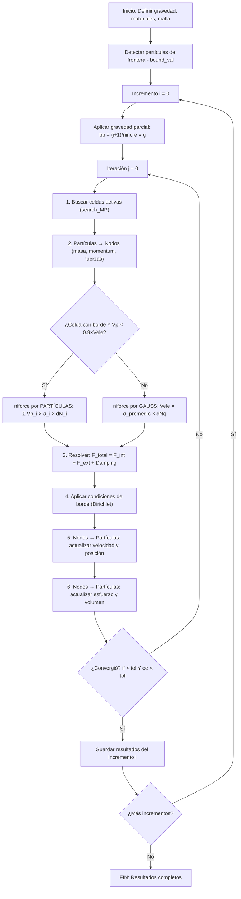

# Análisis Cuasi-Estático MPM — Explicación Paso a Paso

## 1. ¿Qué hace el análisis cuasi-estático?

Simula la aplicación **lenta** de gravedad sobre un suelo (talud, terraplén, etc.). "Cuasi-estático" significa que buscamos el estado de **equilibrio** — donde las fuerzas internas (esfuerzos del suelo) balancean exactamente las externas (peso propio).

En lugar de aplicar toda la gravedad de golpe (lo cual haría que el modelo "explote"), se divide en **incrementos** graduales.

---

## 2. Estructura general

```
┌──────────────────────────────────────────────────────┐
│ _run_quasi_static_increment_loop (L666)              │
│                                                      │
│   for i in range(nincre):       ← Incrementos de     │
│       aplicar gravedad parcial    carga               │
│                                                      │
│       while (ff > tol):         ← Iterar hasta        │
│                                   equilibrio          │
│           _run_one_mpm_step()   ← UN paso MPM         │
│           evaluar convergencia                       │
│                                                      │
│       guardar resultados del incremento              │
└──────────────────────────────────────────────────────┘
```

---

## 3. Bucle externo: Incrementos de carga (L706)

```python
for i in range(nincre):   # ej: nincre = 1
```

**¿Qué hace en cada incremento?**

### 3.1 Aplica la fracción de gravedad (L717-721)

```python
bp0 = self.__vm_bp0                           # gravedad base: [0, -9.81]
self.__vm_bp[:, 1] = (i+1) * dincreGrav * bp0[:, 1]
```

- `bp0` = gravedad completa (ej: `[0, -9.81]` para todas las partículas)
- `dincreGrav` = `1/nincre` (ej: si `nincre=1`, entonces `dincreGrav=1.0`)
- En el incremento `i=0`: `bp = 1.0 * 1.0 * (-9.81)` = gravedad completa
- Si `nincre=10`: incremento 0 aplica 10%, incremento 1 aplica 20%, etc.

> **Nota:** `bp` son las **fuerzas de cuerpo** = aceleración gravitatoria asignada a cada partícula. NO son fuerzas en Newtons todavía — se multiplican por la masa más adelante.

### 3.2 Aplica la fracción de fuerzas externas (L723)

```python
self.__vm_tp_current = (i+1) * dincre * self.__vm_tp0
```

- `tp0` = fuerzas de tracción aplicadas (cargas puntuales definidas por el usuario)
- `dincre` = `1/nincre`
- Misma lógica incremental que la gravedad

---

## 4. Bucle interno: Iteraciones hasta equilibrio (L731)

```python
while (ff > tol_ff) or (ee > tol_ee):
    nmass, niforce, neforce, nvel = self._run_one_mpm_step(...)
    ff, ee, nework = static_convergence(nmass, niforce, neforce, nvel, dtime, nework0)
```

**Filosofía:** Con la gravedad parcial aplicada, el sistema no está en equilibrio. Se itera ejecutando pasos MPM (que mueven ligeramente las partículas y actualizan esfuerzos) hasta que:

- `ff` → **Desbalance de fuerzas** = `||F_ext + F_int|| / ||F_ext||` sea pequeño (las fuerzas se equilibran)
- `ee` → **Energía cinética relativa** = `KE / W_ext` sea pequeña (el sistema se "detiene")

El **damping** (amortiguamiento artificial, L350) ayuda a que converja más rápido eliminando oscilaciones:
```python
ndamping = -dampfac * |nforce| * sign(nmomentum)
```

---

## 5. [_run_one_mpm_step](file:///d:/01%20PROGRAMACION%20Y%20DESARROLLO/Tesis%20UNAL%20Geotecnia/2%20Software/MPM-UN/app/models/model_execute_analysis.py#268-454) — El corazón del MPM (L268)

Cada llamada ejecuta **un ciclo completo** del Método del Punto Material:

```
Partículas → Nodos → Resolver → Condiciones de Borde → Nodos → Partículas
```

### Paso 1: Buscar elementos activos (L301)

```python
mp_elem, active_elem = search_MP(mp_elem, xp, ele_size, nelex)
active_nodes = np.unique(inci[active_elem - 1, :])
```

Determina en qué celda de la malla de fondo está cada partícula. Solo las celdas que contienen partículas ("activas") se procesan.

### Paso 2: Transferir Partículas → Nodos (L306-332)

```python
grid = (inci, cor, active_elem, active_nodes, mp_elem)
particle = (xp, vp, Vp, Mp, sig, bp, tp)

# Con integración mixta (Gauss):
nmass, nmomentum, niforce, neforce, shfnp = particles_to_nodes_gauss2(grid, particle, bound_val)
```

**Esta es la función CLAVE.** Transfiere 4 cantidades de las partículas a los nodos de la malla:

| Variable | Qué es | Fórmula |
|----------|--------|---------|
| `nmass` | Masa nodal | `Σ Ni × Mp` |
| `nmomentum` | Momentum nodal | `Σ Ni × Mp × vp` |
| `niforce` | Fuerza interna | depende de integración (ver abajo) |
| `neforce` | Fuerza externa | `Σ Ni × Mp × bp + Ni × tp` |

#### ¿Cómo se calculan las fuerzas internas? (La parte donde está el problema)

Para cada celda activa, [particles_to_nodes_gauss2](file:///d:/01%20PROGRAMACION%20Y%20DESARROLLO/Tesis%20UNAL%20Geotecnia/2%20Software/MPM-UN/app/motorMPM/explicit3.py#391-482) decide entre dos métodos:

```python
if bound_val[mpe-1] >= 1 AND sum(Vp[mpe-1]) < 0.9 * Vele:
    # INTEGRACIÓN POR PARTÍCULAS (celda parcialmente llena)
    niforce -= Vp_i × (σ_i × dN_i)     # fuerza proporcional al volumen de CADA partícula
else:
    # INTEGRACIÓN DE GAUSS (celda llena)
    sigq = promedio ponderado de σ       # esfuerzo promedio
    niforce -= Vele × (sigq × dNq)      # fuerza proporcional al área de la CELDA
```

> [!CAUTION]
> **Aquí está el problema para distribuciones trianguladas:** En celdas internas (sin partículas de borde), siempre se usa Gauss con `Vele`. Si `sum(Vp) ≠ Vele` (lo cual ocurre con triangulación), la fuerza interna se calcula con un volumen diferente al real.

#### ¿Qué son las fuerzas externas?

```python
neforce[nna, 0] += Ni × Mp × bp[0]    # Peso en x (= 0)
neforce[nna, 1] += Ni × Mp × bp[1]    # Peso en y (= -g × ρ × Vp)
               +  Ni × tp[0/1]        # Cargas de tracción
```

Estas **siempre** usan la masa real `Mp = ρ × Vp`, independientemente de la distribución.

### Paso 3: Resolver ecuaciones nodales (L348-352)

```python
nforce = niforce + neforce                    # Fuerza total = interna + externa
ndamping = -dampfac × |nforce| × sign(p)      # Amortiguamiento artificial
nforce = nforce + ndamping                    # Fuerza total amortiguada
nmomentum += nforce × dt                     # Actualizar momentum (p = p + F×dt)
```

**En equilibrio:** `niforce ≈ -neforce`, entonces `nforce ≈ 0`, y las partículas dejan de moverse.

### Paso 4: Condiciones de contorno (L367)

```python
nmomentum, nforce = BC_Dirichlet_momentum(active_nodes, fixed_X, fixed_Y, ...)
```

En nodos fijos (base, laterales): se pone a cero el momentum y las fuerzas en la dirección restringida.

### Paso 5: Nodos → Partículas (velocidad y posición) (L403)

```python
xp, vp, nvel = nodes_to_particle_vel(grid, particle, nquantities, dtime)
```

- Cada partícula calcula su nueva velocidad: `vp += dt × Ni × F_nodo / m_nodo`
- Cada partícula calcula su nueva posición: `xp += dt × Ni × p_nodo / m_nodo`

### Paso 6: Nodos → Partículas (esfuerzo y volumen) (L429-434)

```python
dtime = 0.005  # ⚠️ HARDCODED
Fp, Vp, epse, epsp, sig = nodes_to_particle_stress_gauss(grid, particle, ...)
```

- Se calcula el gradiente de velocidad nodal → tensor de deformación `dε`
- Se actualiza el esfuerzo: `σ_new = σ + C × dε` (ley constitutiva)
- Se actualiza el volumen: `Vp = Vp × det(F)` (deformación del material)
- Si hay plasticidad → se verifica la función de fluencia (Mohr-Coulomb)

> [!WARNING]
> **`dtime = 0.005` está hardcodeado en la línea 428.** Esto significa que el dt usado para actualizar esfuerzos NO es necesariamente el mismo que el dt definido por el usuario. Verificar si esto es intencional.

---

## 6. Convergencia (L750)

```python
ff, ee, nework = static_convergence(nmass, niforce, neforce, nvel, dtime, nework0)
```

| Criterio | Fórmula | Significado |
|----------|---------|-------------|
| `ff` | `‖F_ext + F_int‖ / ‖F_ext‖` | Desbalance de fuerzas normalizado |
| `ee` | `KE / W_ext` | Energía cinética / Trabajo externo |

Cuando `ff < tol` Y `ee < tol`, el sistema está en equilibrio para ese incremento de carga.

---

## 7. Diagrama de flujo completo



---

## 8. Resumen de dónde influye la distribución de partículas

| Aspecto | Regular | Triangulada | ¿Problema? |
|---------|---------|-------------|------------|
| Volume `Vp` | `Vele / npp` (exacto) | Área del triángulo (variable) | ⚠️ sum(Vp) ≠ Vele en muchas celdas |
| Masa [Mp](file:///d:/01%20PROGRAMACION%20Y%20DESARROLLO/Tesis%20UNAL%20Geotecnia/2%20Software/MPM-UN/app/utils/items_GraphicsResult.py#175-232) | `ρ × Vp` (uniforme) | `ρ × Vp` (variable por partícula) | ✅ Correcto |
| Fuerza externa | `Ni × Mp × g` | `Ni × Mp × g` | ✅ Correcto (usa masa real) |
| Fuerza interna (Gauss) | `Vele × σq × dNq` | `Vele × σq × dNq` | ⚠️ Usa `Vele` aunque material real ≠ Vele |
| Frontera `bound_val` | Calculada 1 vez | Calculada 1 vez | ⚠️ Estática durante todo el análisis |
| Verificación llenado | `sum(Vp) ≈ Vele` → Gauss | `sum(Vp) ≠ Vele` → Gauss (con Vele incorrecto) | ⚠️ Desbalance F_int vs F_ext |

> [!IMPORTANT]
> El desbalance se origina en que `neforce` usa [Mp](file:///d:/01%20PROGRAMACION%20Y%20DESARROLLO/Tesis%20UNAL%20Geotecnia/2%20Software/MPM-UN/app/utils/items_GraphicsResult.py#175-232) (= ρ × Vp_real) pero `niforce` (rama Gauss) usa `Vele` (= área de la celda de fondo). Cuando `sum(Vp) ≠ Vele`, estos no son consistentes y el equilibrio converge a un estado de esfuerzos diferente.
